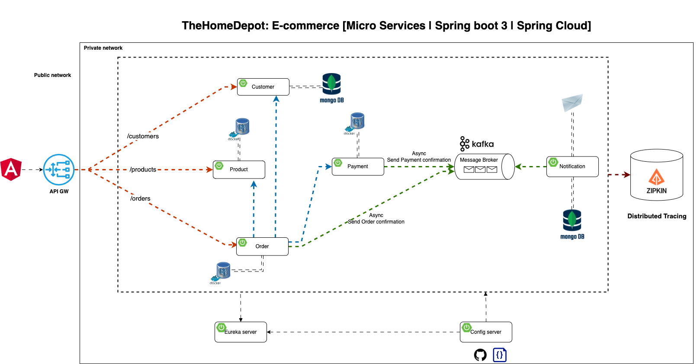

# 🛠️ The Home Depot E-commerce Platform

Welcome to The Home Depot's E-commerce platform repository! This project demonstrates a comprehensive e-commerce system built using microservices architecture. Each service is designed to handle specific business functions, ensuring scalability and maintainability.

## 🏢 Business Domain

This platform focuses on the following key areas:
- **Product Management**: Manage and catalog products.
- **Customer Management**: Handle customer information and interactions.
- **Order Processing**: Manage the lifecycle of orders.
- **Payment Handling**: Securely process payments.
- **Notification Services**: Send notifications to customers.



## 🛠️ Microservices

Here are the core microservices that make up our e-commerce platform:

### 👥 Customer Service
Manages customer data, including profiles, preferences, and purchase history.

### 📦 Order Service
Handles order processing, including order creation, updates, and tracking.

### 💳 Payment Service
Manages payment transactions, ensuring secure and reliable payment processing.

### 📧 Notification Service
Sends email notifications for order confirmations, shipping updates, and promotions.

## 🚀 Technologies

Our platform leverages a variety of modern technologies to ensure robust and efficient performance:

- **Spring Boot**: Framework for building microservices.
- **Spring Cloud**: Tools for building cloud-native applications.
- **RabbitMQ**: Messaging broker for asynchronous communication.
- **Eureka**: Service discovery for load balancing and failover.
- **Zipkin**: Distributed tracing for monitoring microservices.
- **Docker**: Containerization for consistent environments across development, testing, and production.

## 🎯 Project Outcomes

By working on this project, you will gain:

- **Microservices Architecture**: Understanding the principles and benefits of a microservices architecture.
- **Spring Boot Microservices**: Practical experience in developing microservices with Spring Boot.
- **Service Discovery & Configuration Management**: Implementing Eureka and Spring Cloud Config.
- **Asynchronous Communication**: Utilizing RabbitMQ for messaging between services.
- **API Gateway & Distributed Tracing**: Managing API traffic and tracing requests across services.
- **Service Documentation**: Creating comprehensive documentation for services.


## 📝 Getting Started

### Prerequisites

- Docker and Docker Compose installed
- Java 17+
- Spring Boot 3.0.0+
- Maven

### Running the Services

1. Clone the repository:
   ```bash
   git clone https://github.com/yourusername/home-depot-ecommerce.git
   ```
2. Navigate to the project directory:
   ```bash
   cd TheHomeDepot
   ```
3. Start the services using Docker Compose:
   ```bash
   docker-compose up
   ```

### Accessing the Services

- **Eureka Dashboard**: `http://localhost:8761`
- **Zipkin Dashboard**: `http://localhost:9411`

### Building and Running Locally

1. Build the projects:
   ```bash
   mvn clean install
   ```
2. Run each service individually (example for Customer Service):
   ```bash
   cd customer-service
   mvn spring-boot:run
   ```

## 🛡️ Security & Contributions

### Security

Please report any security issues to our team at [imsafay@gmail.com](mailto:security@homedepot.com).

### Contributions

We welcome contributions from the community! Please follow these steps:

1. Fork the repository.
2. Create a new branch (`git checkout -b feature/your-feature`).
3. Commit your changes (`git commit -am 'Add your feature'`).
4. Push to the branch (`git push origin feature/your-feature`).
5. Create a new Pull Request.
